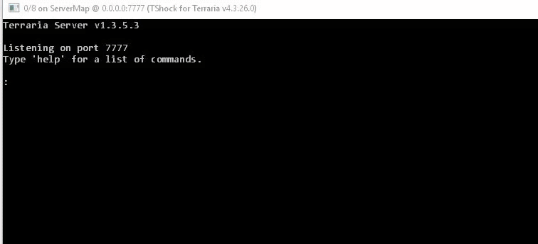

# IronPythonPlugin


## About
This plugin allows you to use IronPython for writing and executing scripts for your TShock server.
You can also run scripts from console or chat for debug purposes.
Python is a very powerful, flexible and pretty fast scripting language.

## Installing
This plugin is for TShock version 4.3.26 and uses Newtonsoft.Json version 10.
To install the plugin you need to do this:
* Install [IronPython](https://ironpython.net/download/).
* Add MyIronMython.dll from archive to server root directory (near TerrariaServer.exe).
* Add ServerPlugins/IronPythonPlugin.dll from archive to ServerPlugins directory.
* Highly recommended to add IronPythonScripts folder from archive to server root path (at least at first).

Then run the server and it will create iron_python_config.json, where you probably want to write something like this:
```json
{
	"command_specifier": "\\",
	"control_permission": "python.control",
	"execute_permission": "python.execute",
	"default_environment": "main",
	"untrusted_environment": "untrusted",
		"environments": {
		"main": {
			"directories": [
				"C:\\Path\\To\\Scripts\\Folder",
				"C:\\Yet\\Another\\Path"
			]
		}
	}
}
```

## Usage
Now you can place .py files in folders specified in config and server will execute them.
You can also use python in console:
```
\from System import *
\Console.WriteLine("ok")
```
The "\\" symbol is defined in config as "command_specifier" and it determines that you are typing python script.
You can use it even from in-game chat with the same syntax if you have execute permission (see config).
Read about IronPython integration to .NET [here](https://ironpython.net/documentation/dotnet/).
This repository already contains a [folder](https://github.com/ASgoPew/IronPythonPlugin/tree/master/IronPythonScripts) with some basic scripts.
It is strongly recommended to add folder with these scripts to config at first. All examples below imply that.

## Basic events
Plugin will run a python function "OnInit" on plugin initialization (and on "/py reset" command) if such exists and
"OnClose" on plugin dipose (and on "/py reset" command as well).
When you try to execute command from console/chat it will first try to execute it through "execute" (see [init](IronPythonScripts/11_init.py)) function if such exists.
Otherwise it will run it directly.

## py command
Plugin adds /py command. You can use /py reset to reset python environment. Environment reset means that all
variables will be removed and all specified in config scripts would be reexecuted.
All plugins using Plugin class (see below) will be uninitialized and then reinitialized automatically.

## Scripts folder
Currently existing scripts allow you to do this:
* Function "puts" that prints all the output to the player who executed the command (in chat) or in console if this is console.
* Python will have a variable "me" of last (or current) player who executed (or executes) the script or the TSPlayer.Server if this is console.
* Use a shortcut for print function: "\\\\1+3" (is the same as "\puts(1+3)") will print "4" in console/chat.
* Use a shortcut for print object properties function: "\\=me" will print all the fields, properties and methods of TSPlayer class.
* Class "Plugin" for creating python plugins in OOP style that allows you to easily register and automatically unregister hooks and commands (see [plugin example](IronPythonScripts/plugin_example.py)).
* A few helper functions like "delay", ...

## Dependencies
This plugin uses [IronPython](https://github.com/IronLanguages/ironpython2)